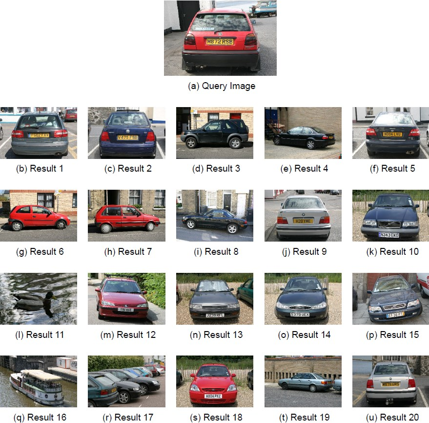

# Visual Search

A MATLAB program which implements various methods of visual search, and provides a method of execution, and statistic generation for them.

This program is intended to use the msrc_v2 image database, downloadable [here](http://research.microsoft.com/en-us/um/people/antcrim/data_objrec/msrc_objcategimagedatabase_v2.zip). Some parts of the program use aspects of this dataset (e.g. the image naming scheme to determine ground truth labels).

Example output for a given search image

##How to use
The simplest way to run the system is to execute visual_search_wrapper.m. This script wraps the main function (vs_visual_search) to allow a single test to be run. visual_search_wrapper is set up to perform any test the system is capable of producing.
**WARNING. The DESCRIPTOR_BASE_DIRECTORY and OUTPUT_BASE_DIRECTORY folders (at the top of visual_search_wrapper) will be written to, and are libable to have their contents erased.**
In order to exectute the system, the IMAGE_DIRECTORY at the top of vs_visual_search.m must be changed to point to the msrc_v2 database image directory.

Other scripts of interest may be:
Testing scripts, located in the 'test' directory. Note these scripts assume that the solution, (and for one of the tests, the lab code), is added to the matlab search path. Testing scripts can be executed individually or all together using MATLAB's runtests command.
Executing runtests in the 'test' directory will execute all tests 

test_pattern_gen/vs_gen_patterns.m generates some funky test patterns you may want to check it out.

You can also generate all of the data used in the report in one shot by running generate_report_data.m
WARNING: This script may take a while! The MAP data in particular takes a long time to calculate (since it compares 2*4*591^2 images)

##Testing and Issues
The solution has been tested on MATLAB r2015b, on Windows 10.

##Doucumentation
This is the doucmentation regarding how to run the program. A report detailing the output of the software exists in the docs folder.

##License
This project is released under the MIT license, see LICENSE.txt.